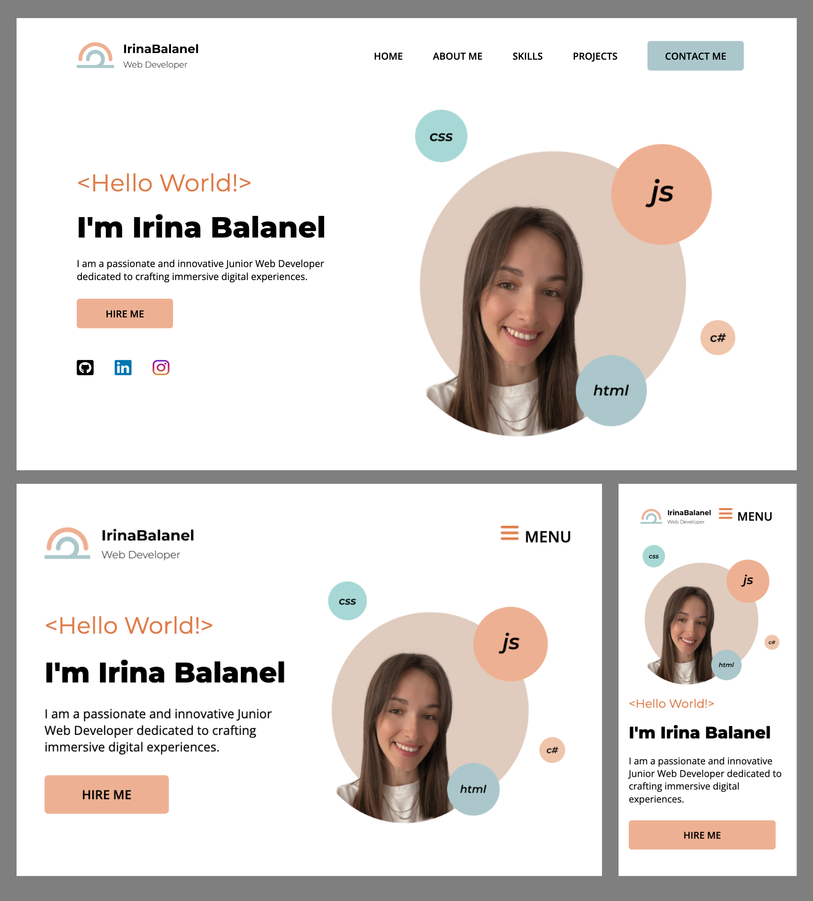

# Portfolio Page
This project aims to demonstrate my abilities as a junior front-end developer by creating a professional and responsive portfolio page. It serves as both a showcase of my skills and a practical example of my work.

## Description
The Portfolio Page is a responsive website implemented using HTML, CSS, and JavaScript. It is designed to work seamlessly on desktop, tablet, and phone devices, based on mockups created in Figma using components and styles.

## Sections of the Site
-	Header: contains the site logo and main navigation links.
-	Footer: includes second navigation, social media links and links to legal documents.
-	Navigation: navigation links to different sections.
-	Body Sections: includes multi-column layouts and images in the following pages:
  	-	Home: an introduction to the portfolio.
  	-	About Me: a brief biography and professional background.
  	-	Skills: a list of technical and soft skills.
  	-	Projects: highlights of key projects with descriptions and links.
- Contact Form: a form for visitors to get in touch.

## Skills Showcased
- Responsive Web Design: creating layouts that adapt to different screen sizes.
- Web Development Best Practices: clean, maintainable code with proper structure.
- Interactive Elements: implementing simple animations and hovers for buttons, links, and graphic elements to enhance user interaction.
- User Experience (UX) and Accessibility: ensuring a smooth and inclusive user experience.
- Design and Prototyping: using Figma for mockups and design consistency.
- Content Organization and Presentation: structuring content logically and aesthetically.

## Cross-Platform Design

